# Arena — Game Development Learning World

[](https://github.com/paramcodes/arena/actions/workflows/ci.yml)
[](https://nextjs.org/)
[](https://docs.pmnd.rs/react-three-fiber)
[](https://rapier.rs/)
[](https://www.typescriptlang.org/)
[](https://tailwindcss.com/)

An interactive, stylized 3D browser learning world where developers and beginners learn game development, real-time rendering, and engine architecture by experimenting with real systems.

Instead of passive video lectures or theoretical text, Arena teaches through a hands-on loop:
$$\text{Experience} \longrightarrow \text{Problem} \longrightarrow \text{Curiosity} \longrightarrow \text{Experiment} \longrightarrow \text{Challenge} \longrightarrow \text{Unlock}$$

Every major concept has a **BREAK IT** mode and a **FIX IT** flow (*Symptom $\to$ Hypothesis $\to$ Evidence $\to$ Verification $\to$ Fix $\to$ Result*).

---

## Video Demo

https://github.com/user-attachments/assets/demo-preview
*(Video demo file is hosted locally and in repository at `public/media/demo.mp4` and `docs/media/videos/demo.mp4`)*

---

## Visual Showcase

| 3D Hub & Mission | Inspector Overlay (F3) |
| :---: | :---: |
| 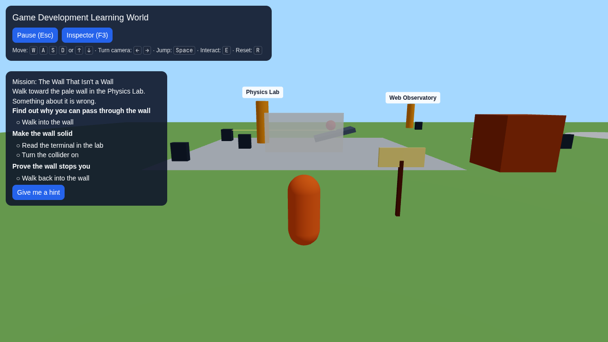 | 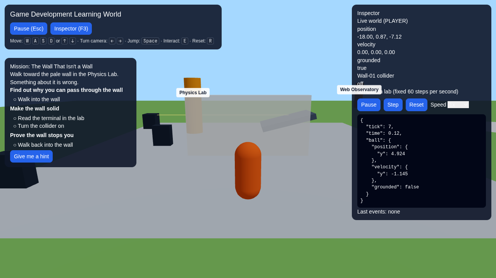 |
| *Explore the 3D hub with active mission tracking* | *Real-time metrics: FPS, draw calls, triangles, position, velocity* |

| Physics Collision Mission | Physics Lab & Rigid Bodies |
| :---: | :---: |
| 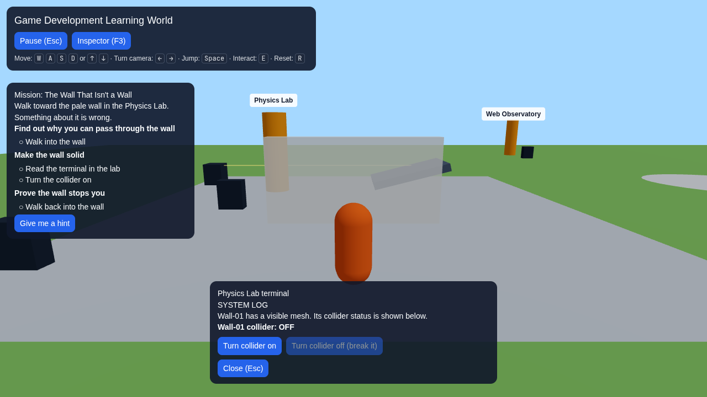 | 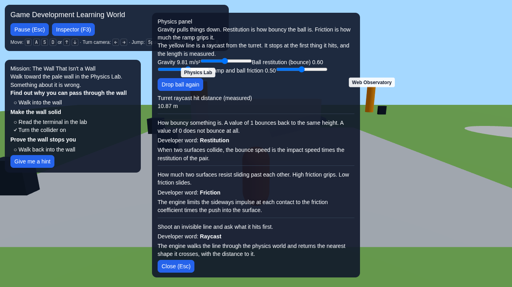 |
| *"The Wall That Isn't a Wall": Break colliders and test penetration* | *Gravity, restitution, friction, raycast turrets, and rigid bodies* |

| Graphics & PBR Materials | Performance Mine (100–50k Trees) |
| :---: | :---: |
| 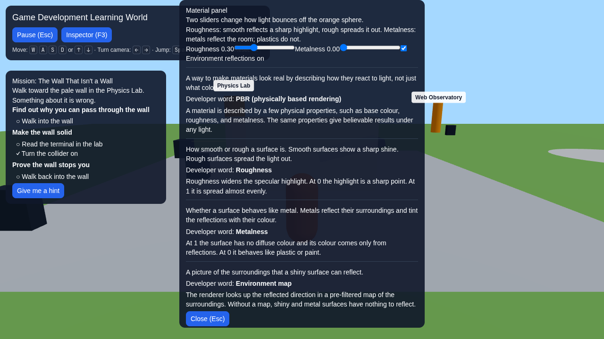 | 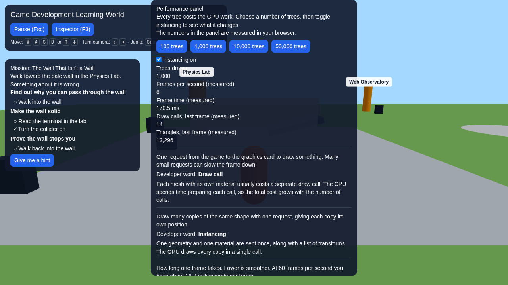 |
| *PBR roughness, metalness, and environment reflection maps* | *Instancing vs separate meshes with live measured draw calls* |

| Animation State Machine | AI Village (FSM vs Utility AI) |
| :---: | :---: |
| 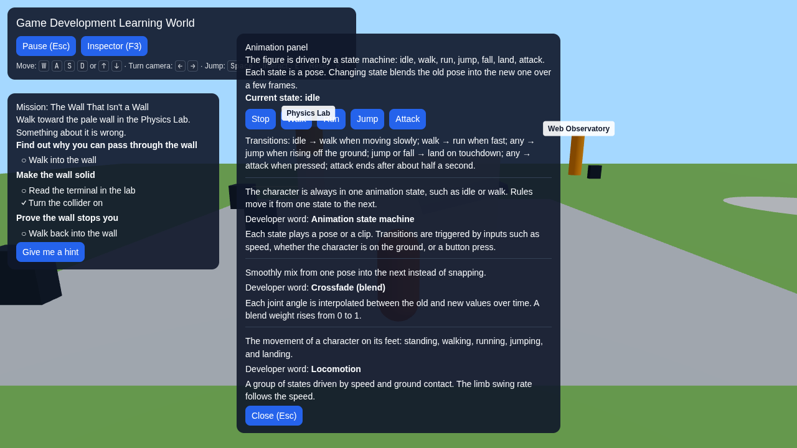 | 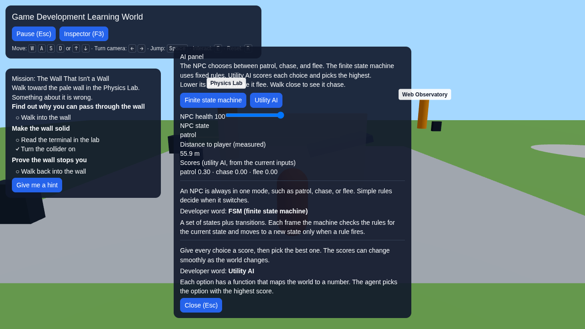 |
| *State transitions, crossfading, and procedural motion* | *Finite State Machines vs Utility scoring decision weights* |

| Systems District (ECS Engine) | Multiplayer Network Simulator |
| :---: | :---: |
| 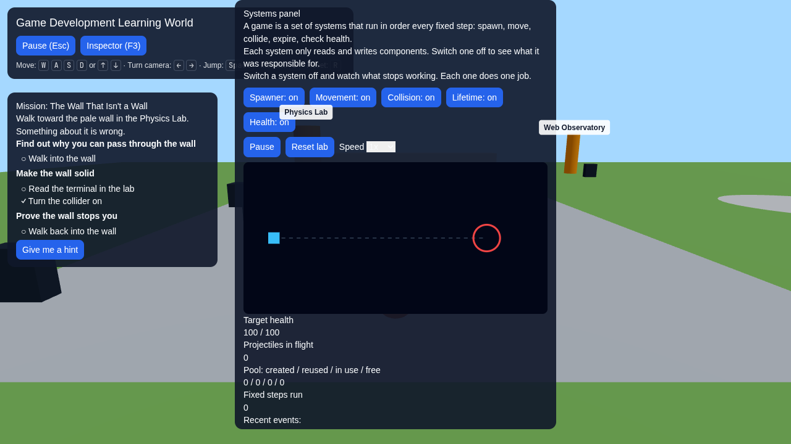 | 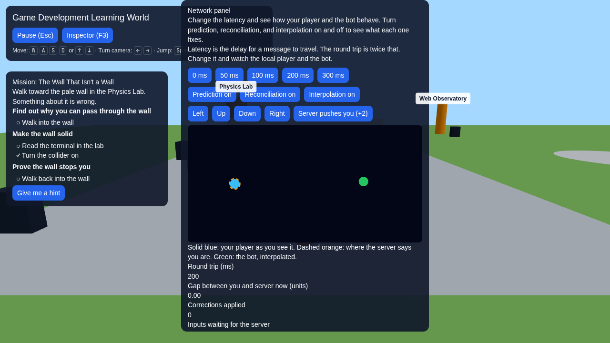 |
| *Entity Component System, memory pools, event bus, fixed ticks* | *0–300ms latency simulation, client prediction, reconciliation* |

| Web Platform Observatory | Game Feel Lab |
| :---: | :---: |
| 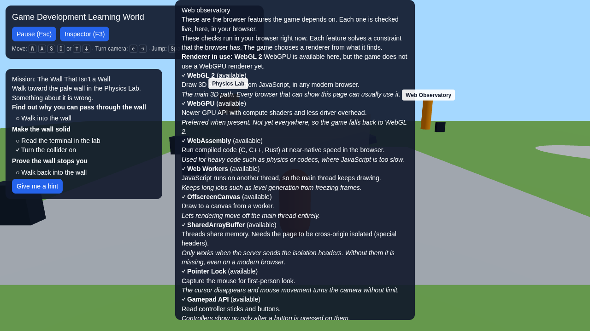 | 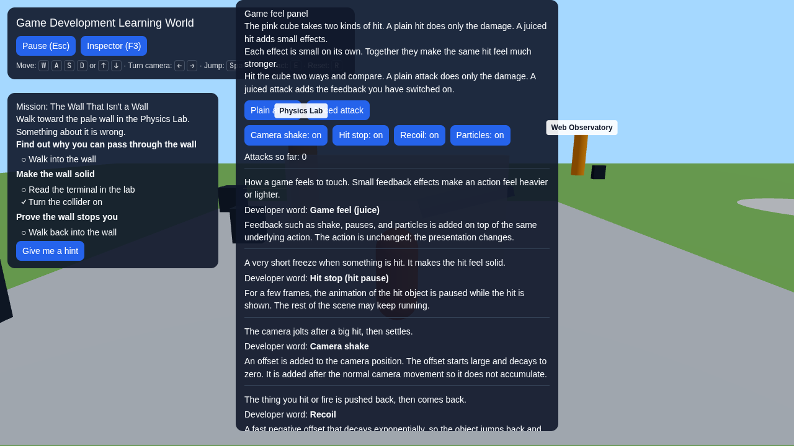 |
| *Live browser capability matrix (WebGL 2, WebGPU, Wasm, Workers)* | *Juice tuning: screen shake, hit-stop, recoil, particle effects* |

| World Builder & Biomes | Learning Map (Knowledge Graph) |
| :---: | :---: |
| 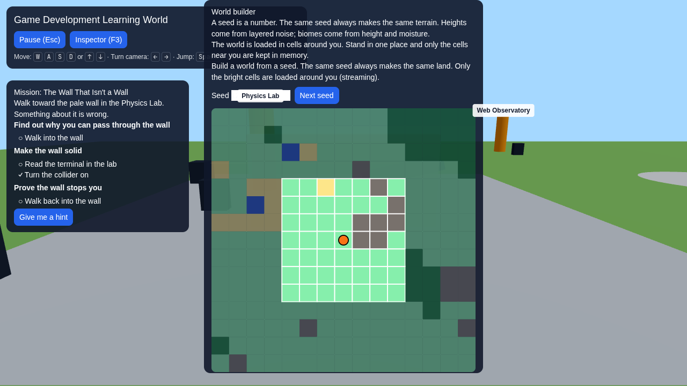 | 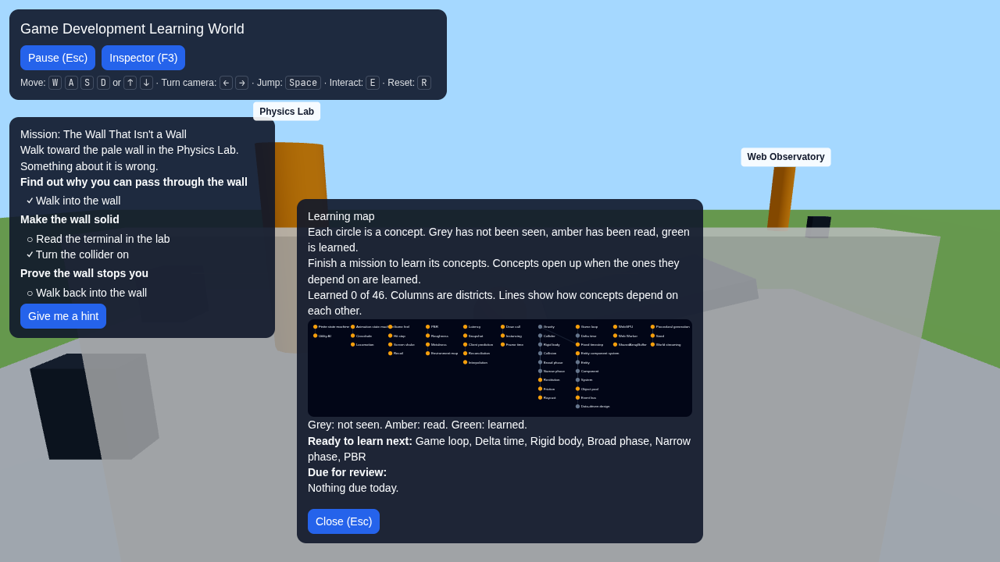 |
| *Procedural noise seeds, biomes, and chunk cell streaming* | *DAG concept dependencies, prerequisite checks, review schedule* |

| AI Tutor Diagnostics | Child Mode & Accessibility |
| :---: | :---: |
| 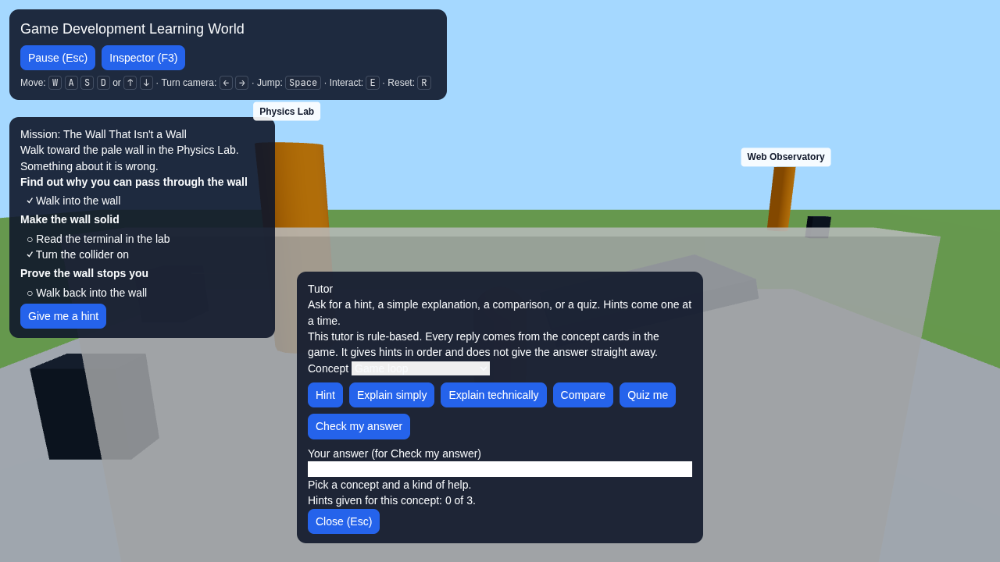 | 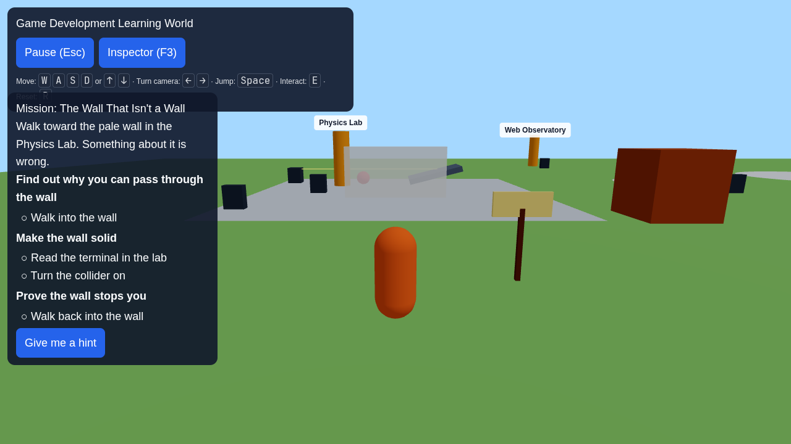 |
| *Rule-based progressive hints and architectural quizzes* | *Simplified language, developer word reveals, high contrast* |

---

## What Problem Arena Solves

1. **Passive Tutorial Hell:** Most game development learning materials rely on videos where students follow instructions without grasping *why* things work. In Arena, learners immediately inspect, break, and fix simulations.
2. **Abstract Vocabulary:** Terms like *draw calls*, *frustum culling*, *AABB colliders*, *restitution*, *ECS archetypes*, and *client-side prediction* are overwhelming in text. Arena makes each term a physical mechanic you can see and measure.
3. **Black-Box Engine Abstractions:** Modern game engines hide the underlying trade-offs. Arena isolates each subsystem so learners see the direct impact of architectural decisions (e.g. comparing 50,000 instanced meshes at 35 draw calls vs separate meshes bottlenecking the GPU).

---

## Interactive Districts & Labs

- **Physics Lab:** Interact with rigid body dynamics, tune gravity, friction, and restitution coefficients, test raycasting sensors, and solve the introductory "The Wall That Isn't a Wall" collision bug.
- **Graphics Forest:** Experiment with Physically Based Rendering (PBR) workflows. Adjust roughness, metalness, and environment reflection maps to see how light behaves on surfaces.
- **Performance Mine:** Stress-test the renderer from 100 to 50,000 objects. Toggle hardware instancing on and off to observe real GPU draw calls, triangle counts, and frame delta times.
- **Animation Studio:** Visualize hierarchical state machines (Idle, Walk, Run, Jump, Attack), configure crossfade blending durations, and observe procedural character motion.
- **AI Village:** Compare autonomous agent algorithms. Toggle between Finite State Machines (FSM) and Utility AI scoring curves to see how NPCs prioritize eating, sleeping, fleeing, and patrolling.
- **Systems District:** Explore engine internals powered by a custom Entity Component System (ECS), pre-allocated object pools, decoupled event buses, and a fixed-timestep game loop.
- **Multiplayer Arena:** Experience network physics under realistic conditions. Inject 0–300ms latency and toggle client-side prediction, server reconciliation, and entity interpolation.
- **Web Observatory:** Audit real-time browser capabilities across WebGL 2, WebGPU, WebAssembly (Wasm), Web Workers, OffscreenCanvas, Gamepad API, and Web Audio.
- **Game Feel Lab:** Discover how games create "juice." Toggle screen shake, hit-stop micro-pauses, knockback recoil, and particle bursts.
- **World Builder:** Generate procedural voxel/biome terrain using simplex noise seeds and inspect 2D/3D chunk streaming boundaries.
- **Learning Map:** Explore the concept graph DAG showing prerequisites, mastery tracking, and spaced repetition review schedules.
- **AI Tutor:** Interactive diagnostic mentor providing progressive hints (Hint 1 $\to$ Hint 2 $\to$ Hint 3 $\to$ Deep Explanation) without giving away solutions.
- **Child Mode & Accessibility:** One-click mode switching to plain language with technical terms hidden behind "Developer word" badges, full keyboard/gamepad navigation, high contrast mode, and reduced motion.

---

## Architecture & Technology Stack

```
src/
├── app/                  # Next.js App Router (dynamic server layout, CSP headers)
├── config/               # Security policy: per-request nonce CSP & security headers
├── game/
│   ├── scene/            # React Three Fiber scenes (Hub, Labs, Districts)
│   ├── ui/               # Semantic HTML UI overlays, dialogs, inspector, tutor
│   ├── store/            # Zustand stores for UI & exploration state
│   ├── world/            # World layout, collision definitions, interactables
│   └── perf/             # Hardware instancing and metrics measurement
├── ecs/                  # Custom Entity Component System, pooling, event bus
├── simulation/           # Discrete deterministic simulation engine
├── net/                  # Multiplayer network predictor, reconciler, and snapshot buffer
├── ai/                   # Finite State Machine & Utility AI decision algorithms
├── animation/            # Animation state machine & crossfade blending
├── feel/                 # Screen shake, hit-stop, and camera recoil state
├── world/                # Simplex noise procedural generation & cell streaming
├── knowledge/            # Concept DAG schemas (Zod) and mission definitions
└── tutor/                # Rule-based progressive hint and diagnostic tutor
```

### Core Technologies
- **Framework:** Next.js 14, React 18, TypeScript (Strict Mode)
- **3D & Graphics:** Three.js, React Three Fiber (R3F), `@react-three/drei`
- **Physics Engine:** Rapier 3D via `@react-three/rapier` (WebAssembly)
- **UI & State:** Tailwind CSS, Zustand, Motion
- **Validation:** Zod for all knowledge graph and mission boundary data
- **Security:** Strict nonce-based Content-Security-Policy (no `unsafe-inline` scripts), Cross-Origin Isolation (`require-corp`, `same-origin`) for SharedArrayBuffer & Wasm
- **Testing:** Vitest (134 unit tests) + Playwright (Headless Chromium E2E with SwiftShader WebGL fallback)

---

## Getting Started

### Prerequisites
- Node.js 22+
- npm 10+

### Installation
```bash
git clone https://github.com/paramcodes/arena.git
cd arena
npm install
```

### Development Server
```bash
npm run dev
```
Open [http://localhost:3000](http://localhost:3000) in your browser.

### Running Tests
```bash
# Run unit & logic tests (134 tests)
npm test

# Run typecheck, unit tests, and build verification
npm run check

# Run Playwright end-to-end browser tests
npm run test:e2e
```

### Production Build
```bash
npm run build
npm run start
```

---

## Controls

| Key / Action | Function |
| :--- | :--- |
| <kbd>W</kbd> <kbd>A</kbd> <kbd>S</kbd> <kbd>D</kbd> or <kbd>↑</kbd> <kbd>←</kbd> <kbd>↓</kbd> <kbd>→</kbd> | Move character / Turn camera |
| <kbd>Space</kbd> | Jump |
| <kbd>E</kbd> | Interact with nearest terminal, panel, or sign |
| <kbd>F3</kbd> | Toggle live Inspector overlay |
| <kbd>Escape</kbd> | Pause menu / Close open dialog |
| <kbd>R</kbd> | Reset player position |

---

## License

MIT
